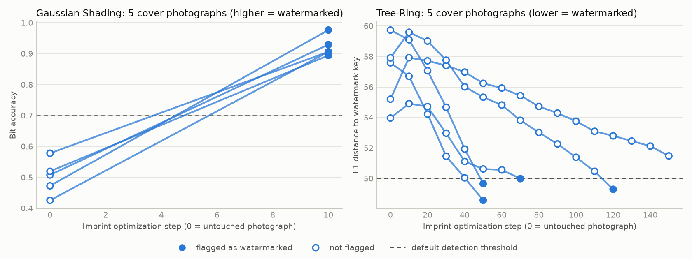

# Forging the Watermark: Benchmarking False Attribution in Semantic Watermarks for Diffusion Models

CMPE 261 (Generative AI), San José State University, Fall 2026. Team project.

Semantic watermarks for diffusion models are tested almost entirely against removal. This project measures the opposite failure: how often an attacker can make an innocent real photograph verify as watermarked.

## Findings so far

Two schemes on Stable Diffusion 2.1-base, attacked with the provider's own model (the strongest case), five real COCO photographs per scheme. The attack is the imprint forgery of Müller et al. (CVPR 2025): optimize the photograph until its inverted noise matches that of a watermarked image.

| Scheme | Clean detection: TPR / FPR generated / FPR real photos | Forged within 60 steps | Forged within 150 steps | PSNR of forgeries |
|---|---|---|---|---|
| Gaussian Shading | 50/50 / 0/50 / 0/50 | 5/5, all by step 10 | not needed | 27.5 dB |
| Tree-Ring | 50/50 / 2/50 / 0/50 | 2/5 | 4/5 | 24.2 dB |

- **Gaussian Shading was forged on every photograph** after 10 optimization steps, about 49 seconds each, with bit accuracy 0.89 to 0.98 against a threshold of 0.7.
- **Tree-Ring is harder but not safe.** Four of five photographs fell under its threshold within 150 steps. Two of those sat just under it (49.99 and 49.7 against 50), and repeated runs differ by about 0.3, so verdicts that close are coin flips. Covers that needed more than 100 steps ended near 20 dB PSNR, a visible cost.
- **Five covers give wide intervals** (4/5 is 38% to 96% at 95% confidence). The next milestone uses 10 covers, six schemes, and fixed step budgets instead of stopping at first detection.

*Detector score for each cover photograph as the imprint proceeds. Step 0 is the untouched photograph; a filled marker means the detector flagged the image as watermarked. Gaussian Shading from the check-in run (60-step cap, every cover flagged at the first check), Tree-Ring from the 150-step run.*

Method, limits, cost, and problems found: [`docs/checkin-1.md`](docs/checkin-1.md). Run logs: [`results/checkin1/`](results/checkin1/) and [`results/tr150/`](results/tr150/).

## Status

Against the commitments in [`docs/project-spec.md`](docs/project-spec.md):

- **F1, clean and real-photo baselines:** 2 of 6 core schemes done at 50 images per cell (spec: 100 watermarked, 200 unwatermarked, 100 real).
- **F2, imprint forgery, same-model attacker:** 2 of 6 core schemes done at 5 covers (spec: 10).
- **F3, removal robustness:** not started.

Measured cost: 4.9 s per imprint step, 4 to 6 s per generation, on one NVIDIA RTX PRO 6000.

## Team

- Kanaka Sarat Siripurapu
- Latha Boralingaiah
- Yashashav Devalapalli Kamalraj

## Documents

| Document | Contents |
|---|---|
| [`docs/project-spec.md`](docs/project-spec.md) | Finalized specification, tentative abstract, report outline |
| [`docs/checkin-1.md`](docs/checkin-1.md) | Data exploration, first results, 150-step follow-up |
| [`data/README.md`](data/README.md) | Data sources and committed selections |

## Layout

| Path | Purpose |
|---|---|
| `src/wmforge/` | Harness over MarkDiffusion, imprint forgery attack, metrics, run log, runner, report |
| `tests/` | Unit tests |
| `scripts/` | Data selection; combined figure across runs |
| `notebooks/01_smoke_colab.ipynb` | Check-in 1 experiment on Colab |
| `results/checkin1/` | Check-in run: log, summary table, figures (both schemes, 60-step cap) |
| `results/tr150/` | Tree-Ring rerun with a 150-step cap |
| `results/figures/` | Figures that combine runs |

## Running

Tests, on any machine:

    uv venv --python 3.12 .venv
    uv pip install --python .venv/bin/python -e ".[dev,attack]"
    .venv/bin/python -m pytest

The experiment needs a GPU. Open `notebooks/01_smoke_colab.ipynb` in Colab and run the cells in order. For a different step cap, run the runner directly on the VM:

    python -m wmforge.smoke --out results/tr150 --schemes TR --stages real imprint --n-real 5 --n-covers 5 --max-steps 150
    python -m wmforge.report --run results/tr150

The combined figure above comes from:

    python scripts/combined_figure.py GS=results/checkin1 TR=results/tr150 --out results/figures/trajectories.png

## License and attribution

GPL-3.0; see `LICENSE`. The imprint attack in `src/wmforge/imprint.py` is adapted from [and-mill/semantic-forgery](https://github.com/and-mill/semantic-forgery) (Müller et al., CVPR 2025), which is GPL-3.0. Watermarking schemes and detectors come from [MarkDiffusion](https://github.com/THU-BPM/MarkDiffusion) (Apache-2.0).
