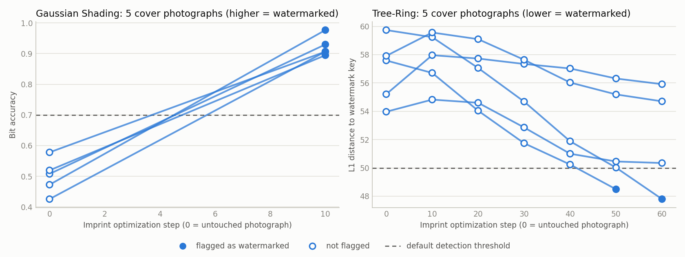
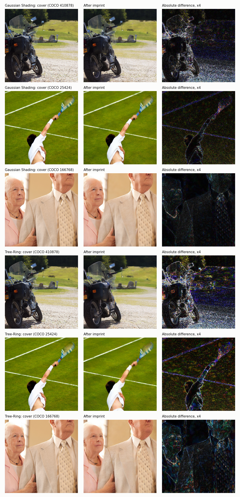
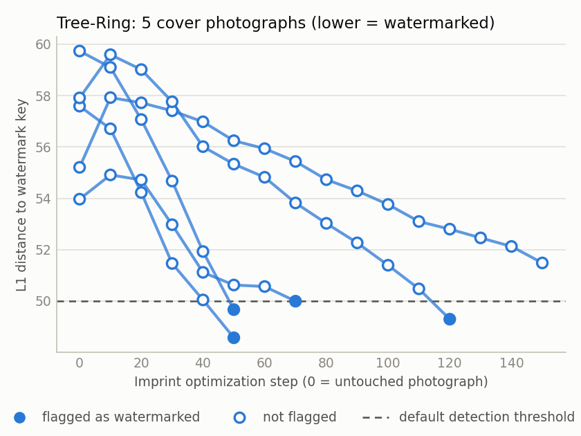

# Check-in 1

**Forging the Watermark: Benchmarking False Attribution in Semantic Watermarks for Diffusion Models**

CMPE 261 Sec 01, Fall 2026. Team: Kanaka Sarat Siripurapu, Latha Boralingaiah, Yashashav Devalapalli Kamalraj.

Repository: https://github.com/yashashav-dk/cmpe261-watermark-forgery

## 1. Where each requirement is met

| Requirement | Where |
|---|---|
| Finalized specifications | [`docs/project-spec.md`](project-spec.md), sections 1 to 10 |
| Tentative abstract | [`docs/project-spec.md`](project-spec.md), section 11 |
| Report outline | [`docs/project-spec.md`](project-spec.md), section 12 |
| Data sources and exploration | Sections 2 and 3 below; [`data/README.md`](../data/README.md) |
| Repository | Link above (public) |
| First results | Section 4 below; [`results/checkin1/`](../results/checkin1) |

## 2. Data sources

No training data is used. The project generates its own evaluation images and reads two public sources.

| Source | Use | Size used at this check-in |
|---|---|---|
| Stable-Diffusion-Prompts, eval split (bundled with MarkDiffusion) | Prompts for generated images | 50 prompts |
| MS-COCO val2017 | Real photographs: forgery covers and real-photo negatives | 50 photographs |
| Stable Diffusion 2.1-base, community mirror pinned by commit | Target model and same-model attacker | one model |

Selections were drawn with a fixed seed and are committed in `data/`.

## 3. What exploring the data showed

- The prompt eval split has 8,192 prompts, 8,036 unique. Length runs from 1 to 258 words with a median of 36, so long prompts are truncated at the text encoder's 77-token limit.
- MarkDiffusion's bundled COCO file contains no images. It indexes 591,753 captions over 118,287 train2017 URLs, so the project fetches val2017 photographs from COCO directly.
- COCO photographs vary in shape and some are grayscale. Covers are centre-cropped to a square and resized to 512×512 RGB.
- MarkDiffusion lists eleven schemes, of which two target video. Nine apply to this project; six need only configuration and three need extra pretrained assets.
- Default detector thresholds are not comparable across schemes (PRC targets a false-positive rate of 1e-9, GaussMarker 1e-6), which is why the full benchmark also reports a common calibrated operating point.
- Stability AI removed the original SD 2.1-base repository; both codebases this project builds on already use community mirrors.
- MarkDiffusion fixes a scheme's starting noise when the scheme is loaded, so repeated generations would share one noise draw. The project's harness resets the seed and the initial latents for every image.

## 4. First results

Tree-Ring (TR) and Gaussian Shading (GS) were run on Stable Diffusion 2.1-base through MarkDiffusion with each scheme's default configuration, in full precision, on one NVIDIA RTX PRO 6000 (Colab). Each scheme saw 50 prompts, 50 COCO photographs, and 5 cover photographs for forgery. The attacker used the same model as the provider.

| Scheme | TPR, watermarked | FPR, unwatermarked | FPR, real photos | Forgery success (imprint, C1) | Median first-detection step | PSNR / SSIM / LPIPS at last step | Seconds per imprint step |
|---|---|---|---|---|---|---|---|
| GS | 50/50 = 100% [93%, 100%] | 0/50 = 0% [0%, 7%] | 0/50 = 0% [0%, 7%] | 5/5 = 100% [57%, 100%] | 10 | 27.5 dB / 0.737 / 0.079 | 4.9 |
| TR | 50/50 = 100% [93%, 100%] | 2/50 = 4% [1%, 13%] | 0/50 = 0% [0%, 7%] | 2/5 = 40% [12%, 77%] | 55 | 24.7 dB / 0.627 / 0.161 | 4.9 |

Brackets are 95% Wilson intervals. Every verdict uses the scheme's default threshold. The full run log is [`results/checkin1/runs.csv`](../results/checkin1/runs.csv).

*Detector score for each cover photograph as the imprint proceeds. Step 0 is the untouched photograph. A filled marker means the detector flagged the image as watermarked.*

*Three covers per scheme: the original photograph, the same photograph after the imprint, and their difference amplified four times.*

### What the numbers show

**Both detectors work on clean images.** Each flagged all 50 of its own watermarked generations. Gaussian Shading flagged no unwatermarked generation and no real photograph. Tree-Ring flagged 2 of 50 unwatermarked generations and no real photograph.

**Tree-Ring's default threshold has little margin on this model.** Its detector flags an image when a distance falls below 50. Watermarked generations scored 23.3 to 46.0, unwatermarked generations 46.7 to 61.7, and real photographs 50.4 to 60.8. A real photograph therefore starts only a few units from being flagged.

**Gaussian Shading was forged on every cover at the first check.** After 10 optimization steps (about 49 seconds) all 5 photographs verified as watermarked, with bit accuracy between 0.89 and 0.98 against a threshold of 0.7. Untouched, the same photographs scored 0.43 to 0.58.

**Tree-Ring was forged on 2 of 5 covers within 60 steps.** The two successes came at steps 50 and 60. The other three ended at 50.3, 54.7, and 55.9, still moving toward the threshold when the run stopped. The reference implementation of the attack runs up to 150 steps, so 2 of 5 says what happens at a 60-step budget, not that the other three resist.

**The forgeries are visibly close to the originals but not free.** PSNR against the original photograph was 22.7 to 31.8 dB for Gaussian Shading and 20.6 to 28.4 dB for Tree-Ring. Part of that loss comes from passing the photograph through the attacker's autoencoder, which was not measured separately.

### Limits of this run

- Five covers per scheme separate "can be forged" from "cannot" only roughly; the intervals above show how wide the uncertainty is.
- Each imprint stopped at the first detection, with a 60-step cap. That uses the detector's verdict, which a real attacker would not have. The benchmark proper reports success at fixed step budgets instead.
- The attacker used the provider's own model. This is the strongest case and an upper bound for attackers with a different model.
- Only default thresholds are reported. The common operating point, calibrated to a 1% false-positive rate, needs the larger baseline in the next step.

### Cost, and what it implies

One imprint step took 4.9 seconds (4.87 to 4.89 across all runs). Generating and detecting one image took 4 to 6 seconds, and detection alone about 2 seconds.

The next milestone needs 60 imprint runs (six schemes, 10 covers each). On this GPU that is about 4.9 GPU-hours at a 60-step budget and about 12.2 GPU-hours at the reference implementation's 150 steps.

### Problems found by running it

- MarkDiffusion's Gaussian Shading builds its latents in float32 and fails on a half-precision pipeline. The target pipeline now runs in full precision for every scheme.
- Colab's preinstalled `torchaudio` does not load against the PyTorch version MarkDiffusion pins. The notebook removes it.

### Follow-up: Tree-Ring at a 150-step budget

The three covers that resisted at 60 steps were still moving toward the threshold, so Tree-Ring was rerun on the same five covers with the cap raised to 150 steps. Everything else stayed the same: same model, same reference images, same stop-at-first-detection rule, same GPU. The run log is [`results/tr150/runs.csv`](../results/tr150/runs.csv).

| Cover (COCO id) | 60-step run | 150-step run | PSNR when stopped |
|---|---|---|---|
| 410878 | not flagged, 54.7 at step 60 | flagged at step 120, 49.3 | 19.6 dB |
| 25424 | flagged at step 60, 47.8 | flagged at step 50, 49.7 | 27.2 dB |
| 166768 | flagged at step 50, 48.5 | flagged at step 50, 48.6 | 28.4 dB |
| 32887 | not flagged, 55.9 at step 60 | not flagged, 51.5 at step 150 | 19.9 dB |
| 519208 | not flagged, 50.3 at step 60 | flagged at step 70, 49.99 | 26.0 dB |

Scores are the L1 distance to the watermark key; below 50 counts as watermarked.

**Four of five covers were forged within 150 steps** (80%, 95% interval 38% to 96%), against two of five at 60 steps. The one miss was still falling about 0.5 per 10 steps at the cap.

**The margins are thin.** Two successes sit just under the threshold (49.99 and 49.7). Repeating the same optimization gives scores that differ by about 0.3: cover 25424 scored 50.02 at step 50 in the first run and 49.67 in the second, which flipped its verdict at that step. Verdicts this close to the threshold should be read as coin flips, which is one reason the benchmark will report success at fixed step budgets with more covers rather than first-detection steps.

**Slow covers pay in quality.** The two covers that needed more than 100 steps ended near 20 dB PSNR against the original photograph, with visible texture change; the fast ones stayed at 26 to 28 dB.

**Cost.** Steps per cover averaged 88 (7.2 minutes); the run took 39 GPU-minutes. Stopping at first detection keeps the 150-step budget well under the 12.2 GPU-hour upper bound above.

*Tree-Ring detector score for each cover photograph under the 150-step cap. Step 0 is the untouched photograph. A filled marker means the detector flagged the image as watermarked.*

## 5. Next steps

In the order fixed by the specification:

1. Clean baseline and real-photo baseline for the six core schemes.
2. Imprint forgery with a same-model attacker for the six core schemes, 10 covers each, at fixed step budgets.
3. Removal robustness under four attacks MarkDiffusion already implements.
4. Imprint forgery with a different Stable Diffusion model as the attacker.
